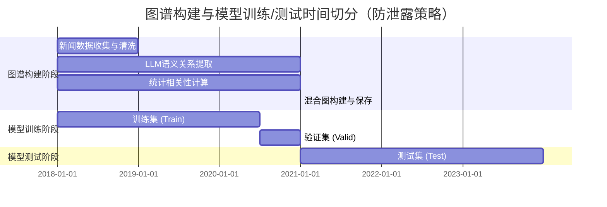

# 图谱构建时间切分流程图（防泄露策略可视化）

## 用途说明
此流程图用于论文的 **"3.3 科学时间切分策略"** 或 **"2.1 模块一：混合动态图谱构建"** 章节，清晰展示图谱构建与模型训练/测试的时间边界，证明无未来信息泄露。

---

## Mermaid 流程图（可直接插入 Markdown/LaTeX）



---

## 时间轴可视化（文本版）

```
时间轴：2018-01-01 ──────────────────────────────────────────────→ 2023-12-31

┌─────────────────────────────────────────────────────────────────────────────┐
│                        图谱构建阶段（Graph Construction）                      │
│                    【严格截止日期：2020-12-31】                                │
├─────────────────────────────────────────────────────────────────────────────┤
│                                                                             │
│  ┌──────────────────────────────────────────────────────────────┐          │
│  │  LLM语义关系提取 + 统计相关性计算                              │          │
│  │  • 新闻数据：仅使用 2018-01-01 ~ 2020-12-31                  │          │
│  │  • 价格数据：仅使用 2018-01-01 ~ 2020-12-31（修复后）          │          │
│  │  • 输出：Graph_Adjacency.npy（静态混合图）                     │          │
│  └──────────────────────────────────────────────────────────────┘          │
│                                                                             │
│  ⚠️ 关键约束：图谱结构（边权重）完全由蓝色区域数据决定，严禁使用红色区域数据 │
│                                                                             │
└─────────────────────────────────────────────────────────────────────────────┘
                                    │
                                    │ split_date = 2020-12-31
                                    │ 【严格时间边界】
                                    ▼
┌─────────────────────────────────────────────────────────────────────────────┐
│                        模型训练阶段（Model Training）                          │
├─────────────────────────────────────────────────────────────────────────────┤
│                                                                             │
│  ┌──────────────────────────────┐  ┌──────────────────────────────┐          │
│  │  训练集 (Train)              │  │  验证集 (Valid)             │          │
│  │  2018-01-01 ~ 2020-06-30     │  │  2020-07-01 ~ 2020-12-31   │          │
│  │  • 模型参数更新              │  │  • 超参数搜索               │          │
│  │  • 梯度下降                 │  │  • 早停监控                 │          │
│  └──────────────────────────────┘  └──────────────────────────────┘          │
│                                                                             │
│  📊 使用图谱：Graph_Adjacency.npy（已在 2020-12-31 前构建完成）              │
│                                                                             │
└─────────────────────────────────────────────────────────────────────────────┘
                                    │
                                    │ 模型训练完成
                                    │ 图谱结构冻结
                                    ▼
┌─────────────────────────────────────────────────────────────────────────────┐
│                        模型测试阶段（Model Testing）                           │
│                    【Out-of-Sample Evaluation】                               │
├─────────────────────────────────────────────────────────────────────────────┤
│                                                                             │
│  ┌──────────────────────────────────────────────────────────────┐          │
│  │  测试集 (Test)                                               │          │
│  │  2021-01-01 ~ 2023-12-31                                     │          │
│  │  • 最终性能评估                                              │          │
│  │  • RankIC / ICIR / 回测指标                                  │          │
│  └──────────────────────────────────────────────────────────────┘          │
│                                                                             │
│  📊 使用图谱：Graph_Adjacency.npy（保持不变，无未来信息）                     │
│                                                                             │
│  ✅ 严格保证：图谱结构在测试阶段完全冻结，不包含任何红色区域的信息            │
│                                                                             │
└─────────────────────────────────────────────────────────────────────────────┘

图例：
┌─────────────────────────────────────────────────────────────────────────────┐
│  🔵 蓝色区域：可用于图谱构建和模型训练的数据（2018-2020）                    │
│  🔴 红色区域：仅用于模型测试的数据（2021-2023），严禁用于图谱构建            │
│  ⚠️  时间边界：split_date = 2020-12-31（严格防泄露截断点）                   │
└─────────────────────────────────────────────────────────────────────────────┘
```

---

## LaTeX TikZ 代码（适合插入论文）

```latex
\begin{figure}[htbp]
\centering
\begin{tikzpicture}[scale=0.9]
    % 时间轴
    \draw[->] (0,0) -- (12,0);
    \node[below] at (0,0) {2018-01-01};
    \node[below] at (6,0) {2020-12-31};
    \node[below] at (12,0) {2023-12-31};
    
    % 图谱构建阶段（蓝色）
    \filldraw[fill=blue!20,draw=blue,thick] (0,2) rectangle (6,3.5);
    \node[above] at (3,3.5) {\textbf{图谱构建阶段 (Graph Construction)}};
    \node at (3,2.75) {LLM语义关系 + 统计相关性};
    \node at (3,2.25) {仅使用 2018-2020 数据};
    
    % 训练/验证阶段
    \filldraw[fill=green!20,draw=green,thick] (0,0.5) rectangle (5,1.5);
    \node at (2.5,1) {训练集 (Train)};
    \filldraw[fill=yellow!20,draw=yellow,thick] (5,0.5) rectangle (6,1.5);
    \node at (5.5,1) {验证集};
    
    % 测试阶段（红色）
    \filldraw[fill=red!20,draw=red,thick] (6,2) rectangle (12,3.5);
    \node[above] at (9,3.5) {\textbf{测试阶段 (Testing)}};
    \node at (9,2.75) {Out-of-Sample Evaluation};
    \node at (9,2.25) {图谱结构冻结，无未来信息};
    
    % 分割线
    \draw[red,thick,dashed] (6,0) -- (6,4);
    \node[above,red] at (6,4) {\textbf{split\_date = 2020-12-31}};
    
    % 箭头说明
    \draw[->,blue,thick] (3,1.5) -- (3,2);
    \node[right,blue] at (3.2,1.75) {图谱构建};
    
    \draw[->,red,thick] (6.5,2.5) -- (9,2.5);
    \node[above,red] at (7.75,2.7) {使用冻结图谱};
\end{tikzpicture}
\caption{图谱构建与模型训练/测试的时间切分策略（防泄露可视化）}
\label{fig:graph_timeline}
\end{figure}
```

---

## 论文中的使用建议

### 1. 插入位置
- **推荐位置 1**：`3.3 科学时间切分策略` 章节，在表格之后添加此流程图
- **推荐位置 2**：`2.1 模块一：混合动态图谱构建` 章节，在"严格截断"部分添加

### 2. 配套文字说明（建议）

> **图 X：图谱构建与模型训练/测试的时间切分策略**
> 
> 为确保实验的学术严谨性，本研究采用严格的时间顺序切分策略，彻底杜绝 Look-ahead Bias（前瞻偏差）。如图所示：
> 
> - **图谱构建阶段（蓝色区域）**：所有图谱结构（包括 LLM 语义关系和统计相关性）仅使用 2018-01-01 至 2020-12-31 的历史数据构建。具体而言：
>   - LLM 语义关系提取：仅处理 `Date < 2020-12-31` 的新闻数据
>   - 统计相关性计算：仅使用 `Date < 2020-12-31` 的价格数据计算收益率相关系数（见第 X.X 节的修复说明）
>   - 最终输出：静态混合图 `Graph_Adjacency.npy`，在后续训练和测试阶段保持不变
> 
> - **模型训练阶段（绿色/黄色区域）**：使用 2018-01-01 至 2020-12-31 的数据进行模型参数更新和超参数搜索，图谱结构已预先构建完成
> 
> - **模型测试阶段（红色区域）**：使用 2021-01-01 至 2023-12-31 的数据进行 Out-of-Sample 评估，图谱结构完全冻结，不包含任何未来信息
> 
> 通过这种严格的时间边界设计，我们确保了图谱结构在测试阶段不会"看到"未来的市场信息，从而保证了实验结果的可靠性和可复现性。

---

## 总结

✅ **Gemini3pro 的建议非常可取**，原因：
1. **可视化增强说服力**：流程图能让审稿人快速理解防泄露策略
2. **符合学术规范**：这是论文"实验设计"章节的标准做法
3. **提升严谨性**：清晰展示时间边界，证明无未来信息泄露

建议在论文的 **"3.3 科学时间切分策略"** 章节插入此流程图，配合文字说明，能显著提升论文的学术严谨性。
